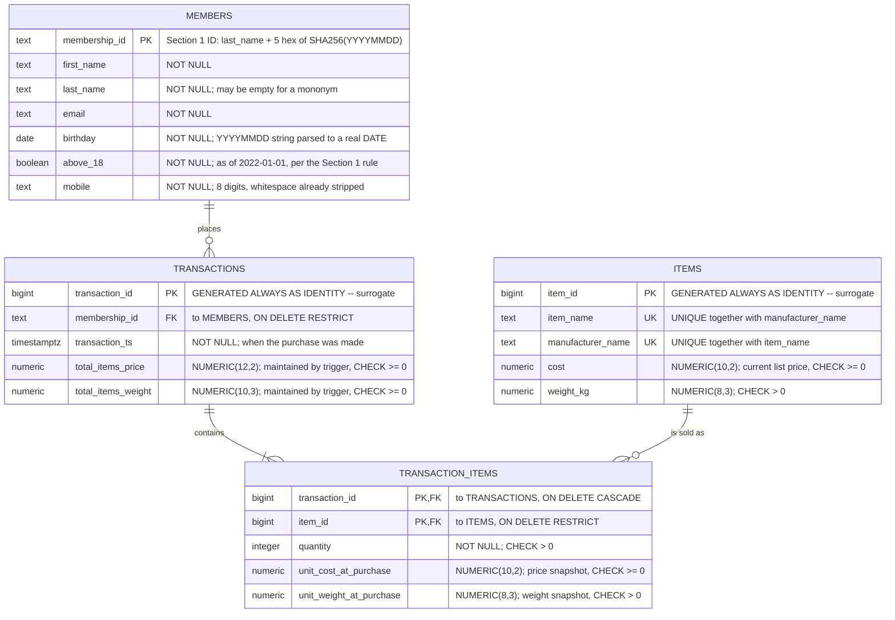

# Section 2 — Sales Transaction Database

A containerised PostgreSQL 16 database for the e-commerce company's sales transactions,
seeded with the first 50 members from [Section 1](../section1_data_pipeline/) and the SQL the
company's analysts asked for.

Everything comes up with one command. The seed is committed as plain SQL so it can be read and
reviewed, and the database stands up from Docker alone — no Python at runtime.

---

## Folder layout

```
section2_database/
├── Dockerfile              FROM postgres:16; copies ddl/ into /docker-entrypoint-initdb.d/.
├── docker-compose.yml      One service, healthcheck, named volume, creds from .env.
├── .env.example            Template for .env, which is gitignored.
├── ddl/
│   ├── 01_schema.sql       Tables, constraints, indexes, comments, the totals trigger.
│   ├── 02_seed_members.sql      Generated: the first 50 Section 1 members.
│   ├── 03_seed_items.sql        Generated: 20-item catalogue across 5 manufacturers.
│   └── 04_seed_transactions.sql Generated: 150 transactions, 474 line items.
├── queries/
│   ├── top10_members_by_spending.sql
│   └── top3_items_by_frequency.sql
├── erd/erd.mmd             Mermaid source for the diagram below.
└── generate_seed.py        Rebuilds ddl/02–04 from the Section 1 output. Stdlib only.
```

Postgres runs everything in `/docker-entrypoint-initdb.d/` in lexical order, which is the only
reason the DDL files are numbered. It runs them **only when the data directory is empty**, so
`docker compose down -v` is how you get back to a clean seed.

## How to run

```bash
cd submission/section2_database
cp .env.example .env
docker compose up -d --build
```

That is the whole setup. First boot runs `initdb`, then the schema, then the three seed files;
the healthcheck goes green in about five seconds.

```bash
docker compose ps          # -> Up (healthy)
docker compose logs db     # initdb + seed output
docker compose down        # stop, keep the data
docker compose down -v     # stop and drop the volume -> next `up` re-seeds
```

### Connection details

| Setting | Value |
|---|---|
| Host | `localhost` |
| Port | `5432` (override with `HOST_PORT` in `.env`) |
| Database | `ecommerce` |
| User | `ecommerce` |
| Password | `ecommerce_local_dev` |

These are throwaway local-development values. `.env` is gitignored; `.env.example` is the
committed template.

`HOST_PORT` exists because 5432 is often already taken by another local Postgres. If
`docker compose up` fails with `Bind for 0.0.0.0:5432 failed: port is already allocated`, put
`HOST_PORT=15432` in `.env` and try again.

### Running SQL

There is no need for a local `psql` — the container has one, and `queries/` is mounted
read-only at `/queries`:

```bash
docker compose exec db psql -U ecommerce -d ecommerce -f /queries/top10_members_by_spending.sql
docker compose exec db psql -U ecommerce -d ecommerce -f /queries/top3_items_by_frequency.sql
docker compose exec db psql -U ecommerce -d ecommerce        # interactive
```

> **Git Bash on Windows:** prefix these with `MSYS_NO_PATHCONV=1`. MSYS rewrites the leading
> `/` in `/queries/...` into a Windows path and psql reports
> `C:/Program Files/Git/queries/...: No such file or directory`. PowerShell, cmd, macOS and
> Linux are unaffected.

---

## Entity-relationship diagram

Source: [`erd/erd.mmd`](erd/erd.mmd). GitHub renders Mermaid natively, so there is one diagram
source rather than a `.dbml` and a `.png` to keep in sync with it.



The cardinality `TRANSACTIONS ||--|{ TRANSACTION_ITEMS` ("one or more") is the honest business
rule but is **not enforced**: a header must exist before its lines can reference it, so
"every transaction has at least one line" needs a deferred constraint trigger firing at
`COMMIT`. That is real complexity for a case the seed cannot produce, so it is documented
rather than built. Everything else on the diagram is enforced by a constraint.

---

## Schema walkthrough

Every table and every column carries a `COMMENT`, so `\d+ members` in psql is a complete
reference. What follows is the reasoning behind the shape.

### `members` — 50 rows

An upstream contract rather than a design decision: the columns are exactly what Section 1
writes to `output/successful/successful_applications_<ts>.csv`, with `birthday` promoted from
a `YYYYMMDD` string to a real `DATE` at the boundary.

`membership_id` is the primary key rather than a surrogate. It comes from upstream, is stable,
and is the identifier both the brief and the analysts speak in; adding a surrogate would put an
extra lookup in front of every join back to Section 1 data for no gain. See assumption 7 for
the uniqueness caveat that comes with it.

Two `CHECK`s beyond the brief:

- `members_mobile_is_8_digits` — Section 1 validates this at ingestion, but nothing stopped a
  hand-written `INSERT` from bypassing that.
- `members_above_18_matches_birthday` — see assumption 6.

### `items` — 20 rows

The natural key is `(item_name, manufacturer_name)` and it is enforced as `UNIQUE`, so the 3NF
requirement is met. The surrogate `item_id` exists so `transaction_items` carries one narrow
`bigint` instead of two text columns.

`cost` is the **current** list price. Historical transactions do not read it — see
`transaction_items` below.

`manufacturer_name` is a plain column, not a `manufacturers` table. Today it is a lone
attribute, so normalising it would buy a join and nothing else. It earns its own table the
moment the business needs manufacturer *attributes* — country of origin, contact, lead time,
an active/discontinued flag — because at that point this design would repeat those values on
every item from that maker, which is the 2NF violation proper. Migration path: create the
table, backfill distinct names, swap the column for a `manufacturer_id`.

### `transactions` — 150 rows

The purchase header. `total_items_price` and `total_items_weight` are derivable from the line
items, so storing them is deliberate denormalisation. Three reasons they stay:

1. The brief names them as transaction attributes, so an analyst expects the column.
2. They are the *invoiced* figure — a point-in-time snapshot that should survive a later
   correction to a line.
3. The top-10-spending query then reads one table instead of aggregating a junction.

The drift risk that normally condemns this is closed by the trigger below: the database
maintains those columns, not whoever writes the `INSERT`.

`transaction_ts` is `TIMESTAMPTZ` rather than `TIMESTAMP` so that moving the deployment off UTC
does not silently reinterpret every historical row.

### `transaction_items` — 474 rows

Resolves the many-to-many between purchases and the catalogue. The brief says a transaction
contains "one item or multiple items" and members "can make multiple purchases" — that is M:N,
and M:N has exactly one correct relational rendering. Putting items on the transaction row
(`item_1`, `item_2`, …) or in an array column would make "top 3 items by frequency" an
unindexable mess.

Composite primary key on `(transaction_id, item_id)`: one line per item per transaction.
Buying three of something is `quantity = 3`, not three rows.

`unit_cost_at_purchase` and `unit_weight_at_purchase` are **snapshots, not lookups**. This is
the single most important decision in the schema. `items.cost` is the current price; a
transaction from 60 days ago must not reprice itself when marketing runs a sale. Without these
columns, `UPDATE items SET cost = ...` silently rewrites every revenue report ever run.

### Delete semantics

Foreign keys are `ON DELETE RESTRICT`, because erasing a member or a catalogue item that has
sales history attached is an accounting hole — anonymise the member or flag the item
discontinued instead. The one exception is `transaction_items.transaction_id`, which
`CASCADE`s: a line item has no independent existence, so deleting a transaction must take its
lines with it or the junction is orphaned.

`transactions.membership_id` is additionally `ON UPDATE CASCADE`. Section 1's README flags that
the membership-ID format needs revisiting if collisions matter; if it is ever corrected, the
fix propagates instead of requiring a manual two-step.

---

## Indexes

Postgres indexes a `PRIMARY KEY` and a `UNIQUE` constraint automatically but **does not index a
foreign key**, so every FK that gets joined or filtered on needs one declared by hand.

| Index | Serves |
|---|---|
| `transactions_membership_id_idx` | The `members → transactions` join in query 1; "this member's order history"; the FK itself. |
| `transactions_transaction_ts_idx` | Every date-bounded analytic ("revenue last quarter"). Becomes the partition key if `transactions` is ever partitioned by month. |
| `transaction_items_item_id_idx` | Grouping the junction by item in query 2, and the `ON DELETE RESTRICT` lookup on `items`. |

`transaction_items(transaction_id)` is deliberately **absent**: it is the leading column of
`transaction_items_pk`, so that index already serves it and a second one would be dead weight.

At the seeded volume the planner correctly ignores all three — see
[Query plans](#query-plans) below for what that means and the evidence that they work.

## Keeping the totals honest

`transaction_items_maintain_totals` is an `AFTER INSERT OR UPDATE OR DELETE ... FOR EACH ROW`
trigger that **recomputes** `transactions.total_items_price` and `total_items_weight` from the
line items.

Recompute rather than validate, for two reasons. `generate_seed.py` never has to compute money
— it inserts headers with the column default of `0`, inserts the line items, and the database
fills in the rest. And a later hand-written `INSERT`/`UPDATE`/`DELETE` on `transaction_items`
cannot desync the header, because there is no code path that changes a line without the
recompute firing.

The aggregate is wrapped in `COALESCE(..., 0)`: `SUM()` over nothing is `NULL`, so deleting the
last line of a transaction would otherwise write `NULL` and fail the `>= 0` `CHECK`.

**Why row-level and not statement-level.** Statement-level with transition tables is strictly
fewer `UPDATE`s, but Postgres rejects it on a multi-event trigger:

```
ERROR:  transition tables cannot be specified for triggers with more than one event
```

so it costs three separate trigger definitions plus `TG_OP` branching to pick the right
transition table. The real workload is a basket of one to five lines, where row-level fires
five times instead of once — unmeasurable. The ceiling is bulk loading: an N-line import does N
re-aggregations. Seeding 474 line items is instant; if a bulk import ever gets slow, split the
trigger into three statement-level ones. That trade-off is recorded in a `ponytail:` comment in
`ddl/01_schema.sql` so the upgrade path is next to the code, not only here.

---

## The seed

`generate_seed.py` reads the Section 1 output and writes `ddl/02`–`04`. It is a **build-time**
tool: the generated SQL is committed, and nothing in it runs against a live container.

```bash
python generate_seed.py                # newest Section 1 output
python generate_seed.py --self-check   # assertions on escaping, dates, determinism
python generate_seed.py --section1-output path/to/successful_applications_x.csv
```

Standard library only — `csv`, `argparse`, `pathlib`, `random`, `datetime`, `logging`. Reading
fifty rows of CSV and emitting SQL text does not justify a dataframe dependency, so this
section has no `requirements.txt`.

It exists for two reasons: to make the seed reproducible, and to make the Section 1 → Section 2
linkage explicit rather than a claim in a README. Regenerating produces byte-identical files:

```bash
python generate_seed.py && git status --short ddl/    # -> no output
```

That works because `RANDOM_SEED` is fixed, the transaction window is anchored to the Section 1
run timestamp rather than `now()`, and files are written with explicit LF endings.

### What it generates

| File | Contents |
|---|---|
| `02_seed_members.sql` | One multi-row `INSERT`: the first 50 members, `birthday` parsed to ISO `DATE`. |
| `03_seed_items.sql` | 20 items across 5 manufacturers, with explicit `item_id`s. |
| `04_seed_transactions.sql` | 150 headers + 474 line items over the 90 days to 2026-09-18. |

Both generated seed files use `OVERRIDING SYSTEM VALUE` to write explicit IDs, then `setval`
the identity sequence past them. That keeps 474 line items readable as plain integers instead
of burying a correlated subquery in every one, and leaves the sequences usable — the next real
`INSERT` into `items` gets `item_id = 21`.

The catalogue carries a `popularity` weight that is **generator-only** and never stored. It is
deliberately skewed (40 / 34 / 28 for the top three, 16 for the fourth) so query 2 has an
unambiguous answer instead of a coin toss between near-ties.

---

## The analyst queries

### 1. Top 10 members by spending

[`queries/top10_members_by_spending.sql`](queries/top10_members_by_spending.sql) — grain: one
row per member; metric: `SUM(transactions.total_items_price)`, all time.

```
  membership_id   | first_name | last_name  | transaction_count | total_spent
------------------+------------+------------+-------------------+-------------
 Murphy_0851c     | Amanda     | Murphy     |                 6 |     5327.40
 Garcia_26b55     | April      | Garcia     |                 7 |     5280.60
 Strickland_c13f0 | Jeremy     | Strickland |                 5 |     4307.40
 Estrada_0bf5b    | Richard    | Estrada    |                 5 |     3690.90
 Bishop_b0506     | Vernon     | Bishop     |                 5 |     2903.90
 Allison_0c21b    | Jessica    | Allison    |                 6 |     2488.50
 Thompson_16040   | Samuel     | Thompson   |                 3 |     2370.30
 Hall_b302a       | Arthur     | Hall       |                 4 |     2341.70
 Nichols_9226a    | David      | Nichols    |                 3 |     2248.20
 Thompson_52cd0   | Stephen    | Thompson   |                 5 |     2054.60
(10 rows)
```

Rows 7 and 9 have three transactions each and still out-spend members with five: basket value,
not visit count, which is what ranking by spend is for.

### 2. Top 3 items by frequency

[`queries/top3_items_by_frequency.sql`](queries/top3_items_by_frequency.sql) — grain: one row
per catalogue item; metric: distinct transactions containing the item.

```
 item_id |    item_name     |  manufacturer_name  | times_bought | total_quantity
---------+------------------+---------------------+--------------+----------------
       1 | Wireless Earbuds | Aurora Audio        |           63 |            119
       7 | Scented Candle   | Basalt Home         |           58 |            111
      10 | Insulated Bottle | Cindermill Outdoors |           47 |             93
(3 rows)
```

Both readings of "frequently bought" (see assumption 3) return the same three items in the same
order here, so the answer is robust to the ambiguity. Fourth place is 12 purchases back.

Both queries carry explicit tiebreakers. Without them the same data can return a different
tenth row across runs, which makes a report untrustworthy.

### Query plans

`EXPLAIN (ANALYZE, BUFFERS)` on the seeded database:

| Query | Plan | Buffers | Time |
|---|---|---|---|
| Top 10 members | `Seq Scan transactions` → `Hash Join` (`Seq Scan members`) → `HashAggregate` → top-N heapsort | 13 | 0.501 ms |
| Top 3 items | `Seq Scan transaction_items` → `GroupAggregate` → `Hash Join` (`Seq Scan items`) → top-N heapsort | 8 | 0.380 ms |

**Neither query uses an index, and that is the planner being right.** The whole database is
96 kB — `items` and `members` are one 8 kB page each, `transactions` six, `transaction_items`
four. A sequential scan reads all of `transactions` in one go; an index scan would read the
index *and* then the heap. Even a single-member lookup returning 6 of 150 rows chooses a seq
scan. A plan claiming index usage at this size would mean the planner was misconfigured.

To show the indexes are correctly defined rather than merely unused, `transactions` was scaled
to 200,000 rows inside a rolled-back transaction and the same lookups re-run:

```
-- membership_id lookup at 200k rows
 Bitmap Heap Scan on transactions
   ->  Bitmap Index Scan on transactions_membership_id_idx      <-- engaged

-- date-range scan at 200k rows
 Index Only Scan using transactions_transaction_ts_idx          <-- engaged
   Heap Fetches: 2
```

Both engage the moment the table is large enough to justify them.
`transaction_items_item_id_idx` plays the same role for query 2 once the junction outgrows its
four pages; at 474 rows a full scan is unavoidable because the query touches every item anyway.

---

## Verification

From a clean state:

```bash
docker compose down -v && docker compose up -d --build
```

| Check | Result |
|---|---|
| Container health | `Up (healthy)` after ~5 s, no errors in the init log |
| Row counts | `members` 50, `items` 20, `transactions` 150, `transaction_items` 474 |
| Header totals match their line items | 150 / 150 on price **and** weight; 0 left at the default |
| Every member has ≥1 transaction | 0 members without one |
| Basket size within 1–5, quantity within 1–3 | `min/max basket` 1/5, `min/max qty` 1/3 |
| Transaction window | 2026-06-20 → 2026-09-17 (90 days) |
| `COMMENT` coverage | 4/4 tables, 22/22 columns |
| Sequences usable after seed | next `item_id` = 21 |
| Seed reproducibility | regenerate → byte-identical, empty `git diff` |
| Generator self-check | `python generate_seed.py --self-check` → OK |

Constraints were confirmed to reject bad data rather than assumed to: a member born in 2010
flagged `above_18`, a seven-digit mobile, a negative `cost`, a zero `weight_kg`, a duplicate
`(item_name, manufacturer_name)`, and deleting a member who has a transaction are all refused.
Deleting a transaction cascades its lines to zero.

---

## Assumptions

Design choices the brief leaves open, and why each was made this way.

### 1. "The first 50 members" means the first 50 rows in file order

Section 1 writes rows in the order it read them, so this is stable for a given input. The
alternative readings — first 50 by membership ID, or by birthday — would be arbitrary orderings
the brief never mentions.

### 2. Transaction data is synthetic

The brief supplies no sales data, so 150 transactions are generated over the 90 days before a
fixed reference date. That date is the `YYYYMMDD_HHMMSS` stamp in the Section 1 filename, not
`now()`: using the wall clock would make the committed SQL churn on every regeneration and turn
a `git diff` into noise. The stamp is treated as UTC — Section 1 writes local time, but nothing
downstream depends on the offset being right, only on it being fixed.

### 3. "Frequently bought" means distinct transactions, not units sold

The phrase is ambiguous and the two readings disagree:

- **How many baskets contained it** — how many separate purchase decisions the item was part
  of. A 50-pack of batteries bought once is one event.
- **How many units were sold** — volume. That same 50-pack outranks almost everything.

The first is implemented as the primary metric, because "frequently bought" is a statement
about the frequency of the buying rather than the size of the purchase — it is the reading a
merchandiser wants for "what do people reach for". `total_quantity` is returned alongside and
is the first tiebreaker, and a commented alternative in the query file flips the ranking to
volume. On this data both give the same answer.

### 4. Totals are persisted on the transaction header

Denormalised, because the brief lists them as transaction attributes, because they are the
invoiced snapshot, and because the top-10 query then reads one table instead of aggregating a
junction. Safe because a trigger owns them — see
[Keeping the totals honest](#keeping-the-totals-honest).

### 5. Unit cost and weight are snapshotted on the line item

`items.cost` is the current list price; `transaction_items.unit_cost_at_purchase` is what was
actually paid. Without the snapshot, changing a catalogue price would rewrite history and every
revenue report with it. In the seed the two are equal because the catalogue is static; in a
live system they diverge, and that divergence is the entire point of the columns.

### 6. `above_18` is stored, with a consistency check

`above_18` is derivable from `birthday`, so storing it is a functional dependency on a non-key
attribute — strictly, a 3NF blemish. It is kept because it is part of the Section 1 contract
and dropping it would mean the table no longer matches the file it loads.

Section 1 still **owns** the rule. The database only refuses a row where the flag contradicts
the birthday:

```sql
CHECK (above_18 = (birthday <= DATE '2003-01-01'))
```

"Over 18 on 2022-01-01", read strictly, means the 19th birthday fell on or before that date,
which is a birthday on or before 2003-01-01. Two alternatives were considered and rejected: a
plain column with no check (nothing stops a bad load flagging a child as an adult), and a
`GENERATED ALWAYS AS ... STORED` column (strictly 3NF, but it moves ownership of a Section 1
business rule into the database, expressed in a second place). If Section 1's reference date
ever moves, this load fails loudly rather than drifting silently — which is the point.

### 7. Membership-ID collisions

Section 1 defines the ID as `<last_name>_<first 5 hex of SHA-256(YYYYMMDD)>` — a function of
surname and birthday alone, so two people sharing both receive the same ID. The sample collides
once: Kenneth and Bethany Williamson, both born 1954-03-10, both `Williamson_2b72a`. 694 unique
IDs for 695 applicants. Section 1 documents this under
["Membership IDs are not guaranteed unique"](../section1_data_pipeline/README.md).

`Williamson_2b72a` appears at data rows 273 and 436, so **the first 50 rows are collision-free** and the
primary key is safe on the committed seed. `generate_seed.py` still de-duplicates with a logged
warning — a guard against a future Section 1 run whose ordering differs, not a workaround for
today's data.

De-duplication drops the later row and does **not** reach further down the file to top the
count back up to 50. "The first 50 members" means the first 50 rows; quietly substituting row
51 would change which members are in the database and make the seed depend on collision luck. A
collision inside the window would therefore yield 49 members, loudly.

The primary key stays enforced either way. A database that accepts two people under one member
ID is worse than one that drops a row and says so.

### 8. Explicit IDs in the seed

`item_id` and `transaction_id` are `GENERATED ALWAYS AS IDENTITY`, so writing explicit values
needs `OVERRIDING SYSTEM VALUE`. Worth the keyword: it lets 474 line items reference items as
plain integers instead of burying a correlated subquery in each one, which keeps the seed
reviewable. Sequences are fast-forwarded with `setval` so the next real insert does not
collide.

---

## How this scales

Nothing here is sized for a real e-commerce business; these are the first three things that
change when it is.

**Partition `transactions` by month.** It is the table that grows without bound, and almost
every analytical query is date-bounded. `PARTITION BY RANGE (transaction_ts)` lets the planner
prune to the months in scope, turns "drop data older than N years" into a `DETACH PARTITION`
instead of a long `DELETE`, and keeps per-partition indexes small enough to stay cached.
`transactions_transaction_ts_idx` is already on the column that would become the partition key.
`transaction_items` would follow, partitioned on the same key propagated down.

**Read replicas for analysts.** The two queries here are cheap, but analysts write exploratory
SQL and a runaway `GROUP BY` should not contend with checkout. A streaming replica gives them a
consistent, slightly stale copy with no risk to the write path — and the persisted header
totals mean the common spending queries never touch the junction at all.

**A `manufacturers` table.** The moment manufacturer attributes appear — country of origin,
contact, lead time, discontinued flag — `items.manufacturer_name` starts repeating them per
item and the model drops out of 2NF. Create the table, backfill distinct names, swap the column
for a `manufacturer_id`.

Two smaller things worth doing before any of the above: enforce "a transaction has at least one
line item" with a deferred constraint trigger once the write path is more than a seed script,
and revisit the membership-ID format upstream — five hex characters is 1,048,576 distinct hash
values, so collisions grow with volume and the primary key here inherits that ceiling.
