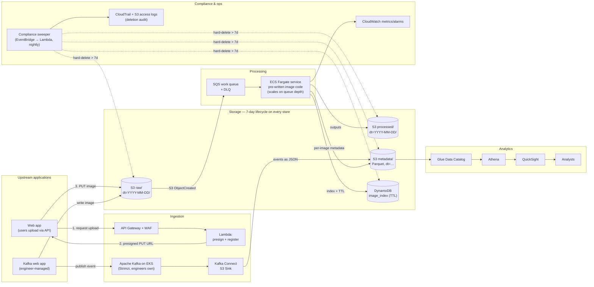

# Section 3 – System Design: Cloud Image-Processing Platform (AWS)

End-to-end architecture for a company whose core business is processing images. Two upstream applications deliver images (a REST API and an engineer-managed Kafka stream), pre-written processing code runs in the cloud, images and metadata are retained for exactly 7 days and then purged, and analysts get a BI layer over the data.

**Diagram:** [`architecture.drawio`](architecture.drawio) (editable) · [`architecture.png`](architecture.png) (rendered). A Mermaid rendition is embedded in §3 so the flow is readable on GitHub without opening the image.

---

## 1. Requirements → design mapping

| Requirement in the brief | Where it is addressed |
|---|---|
| Web app uploads images via an API | API Gateway → Lambda issues **presigned S3 PUT URLs**; the browser uploads directly to the raw bucket (§4.1) |
| Separate web app hosts a Kafka stream, **managed by the company's engineers** | **Self-managed Apache Kafka on EKS (Strimzi operator)** in an engineer-owned VPC; the data platform only *consumes* via a Kafka Connect S3 Sink the engineers operate (§4.2) |
| Pre-written processing code must be hosted in the cloud | Packaged as a container, run as an **ECS Fargate service** that scales on SQS queue depth (§4.3) |
| Images + metadata stored for 7 days, then purged (compliance/privacy) | Every store enumerated with its own purge control, a nightly **compliance sweeper** as backstop, and an audit trail (§5) |
| BI resource for analysts | Metadata landed as partitioned Parquet in S3 → Glue Data Catalog → **Athena** → **QuickSight** (§4.5) |
| Indicate assumptions | §2 |
| Detailed explanation of the diagram | §4 |

---

## 2. Assumptions

1. **Cloud provider:** AWS, single region (`ap-southeast-1`), multi-AZ. Chosen for the breadth of managed services; equivalents exist on Azure/GCP but a single coherent provider is clearer than a matrix.
2. **"Managed by the company's engineers"** is read literally: the Kafka *cluster* is operated by the engineers (self-hosted on EKS via the Strimzi operator), not by a cloud-managed Kafka service. The data-platform team owns everything downstream of the topic. Amazon MSK is noted as an alternative if the engineers later decide they only want to own topics and consumers, not brokers.
3. **Kafka messages carry image references, not image bytes** (claim-check pattern): the Kafka web app writes the image to the raw bucket and publishes a small JSON event (`image_id, s3_key, size, content_type, uploaded_at`). This keeps messages under Kafka's 1 MB default and avoids doubling storage. If the engineers insist on inline bytes, `max.message.bytes` is raised and the sink connector writes the bytes to S3 – the rest of the design is unchanged.
4. **The processing code is containerisable** (any language; runs with an input path and writes outputs). Nothing is assumed about runtime length, which is why ECS Fargate is used rather than Lambda (15-minute limit). If every job is known to finish in < 15 min and < 10 GB memory, Lambda is a cheaper drop-in.
5. **Image sizes:** typically ≤ 25 MB, occasionally up to a few hundred MB. Presigned direct-to-S3 uploads sidestep API Gateway's 10 MB payload limit.
6. **"7 days"** means *no copy of an image or its per-image metadata exists anywhere in the environment more than 7 days after upload*. Aggregated, non-identifying metrics (daily counts, p95 latency) are **not** subject to purge and may be retained for trend analysis – this is an explicit decision the compliance team must confirm.
7. **Analysts** query metadata and derived metrics, not image pixels. They have read-only access and never see raw buckets directly.
8. **Idempotency:** `image_id` is a UUID assigned by the producer; the same image arriving via both paths is de-duplicated on `image_id` at the processing step.
9. **Volume:** on the order of 10^5 – 10^6 images/day. Every component chosen scales horizontally; nothing here is sized for a specific number.

---

## 3. Flow overview

---

## 4. Component-by-component explanation

### 4.1 Ingestion path A – REST API uploads

| Component | Role |
|---|---|
| **Amazon API Gateway (HTTP API) + AWS WAF** | Public entry point. WAF blocks common attacks and rate-limits per client; API Gateway authenticates (Cognito JWT or API key), throttles and routes. |
| **Lambda `presign`** | Validates the request (content type, declared size ≤ limit), generates an `image_id`, returns a **presigned S3 PUT URL** valid for 5 minutes for key `raw/dt=<date>/<image_id>.<ext>`. Writes a `PENDING` row to `image_index`. |
| **Direct browser → S3 upload** | The client PUTs bytes straight to S3. No image bytes ever pass through API Gateway or Lambda, so there is no payload-size ceiling and no compute cost proportional to image size. |

Why not upload through the API? API Gateway caps payloads at 10 MB and Lambda at 6 MB; proxying bytes would also make the API the throughput bottleneck. Presigned URLs are the standard pattern for this.

### 4.2 Ingestion path B – engineer-managed Kafka stream

| Component | Role |
|---|---|
| **Apache Kafka on EKS (Strimzi operator)** | Runs in a VPC the engineering team owns. They control broker count, versions, topics, partitions, ACLs, retention and consumer groups – which is what "managed by the company's engineers" requires. Strimzi gives them Kubernetes-native operations (rolling upgrades, rack awareness across 3 AZs) without a cloud-managed black box. |
| **Topic `image-events`** | 3× replication, `min.insync.replicas=2`, **`retention.ms = 7 days` and `cleanup.policy=delete`** so the topic itself cannot hold data past the purge window. |
| **Kafka Connect – S3 Sink connector** | Off-the-shelf connector, no custom consumer code. Flushes events as JSON to `s3://…/metadata/source=kafka/dt=…/`. Run as a Strimzi `KafkaConnect` resource, so the engineers operate it with the same tooling as the brokers. Because the Kafka web app already wrote the image to `raw/` (assumption 3), the S3 `ObjectCreated` event – not the Kafka event – is what triggers processing; the Kafka event is retained for lineage and analytics. |

**Alternative considered:** Amazon MSK. It removes broker operations but hands cluster management to AWS, which reads against the brief. If the engineers' intent is only to own topics and consumers, MSK is the lower-toil swap and nothing downstream changes.

**Why the two paths converge on S3 rather than on Kafka:** S3 is the durable system of record and gives a single trigger point, a single lifecycle policy and a single audit surface. Routing API uploads *into* Kafka would add a hop and a second copy to purge.

### 4.3 Processing

| Component | Role |
|---|---|
| **S3 event notification → SQS `image-work` queue** | Every `ObjectCreated` under `raw/` becomes a message. SQS provides buffering during bursts, at-least-once delivery, visibility timeouts for retries, and a **dead-letter queue** after 3 failed attempts. S3 cannot invoke ECS directly, and coupling through a queue is what makes the compute layer independently scalable. |
| **Amazon ECR** | Holds the container image built from the engineers' existing processing code (`Dockerfile` wraps it; the code itself is untouched). |
| **ECS on Fargate – `image-processor` service** | Long-running consumers poll SQS, download the object, run the pre-written code, upload outputs to `processed/dt=…/<image_id>/`, write one Parquet metadata record to `metadata/dt=…/`, and mark `image_index` as `DONE`. **Target-tracking autoscaling on `ApproximateNumberOfMessagesVisible / running tasks`** scales from 0–2 tasks at night to hundreds under load. Fargate removes host management; Spot capacity is used for the bulk of tasks with On-Demand as a floor. |
| **Idempotency** | Before processing, the task does a conditional `DONE?` check on `image_index`; duplicates (same `image_id` from both paths, or an SQS redelivery) are acknowledged and skipped. |

**Alternative considered:** Lambda container images – simpler and cheaper for short jobs, but the 15-minute / 10 GB ceiling is a risk when the workload is unknown. AWS Batch is the swap if jobs are large and batchy rather than streaming.

### 4.4 Storage

One bucket, three prefixes, all partitioned by upload date so that both lifecycle purge and analytical queries work on prefixes:

| Prefix / store | Content | Format |
|---|---|---|
| `s3://img-platform/raw/dt=YYYY-MM-DD/` | Original uploads | as uploaded |
| `s3://img-platform/processed/dt=YYYY-MM-DD/<image_id>/` | Outputs of the processing code | as produced |
| `s3://img-platform/metadata/dt=YYYY-MM-DD/` | One record per image: `image_id, source (api/kafka), uploaded_at, processed_at, duration_ms, width, height, format, bytes_in, bytes_out, status, error` | Parquet (Snappy), Hive partitions |
| **DynamoDB `image_index`** | Operational index only: `image_id → status, s3 keys, expires_at` for idempotency and API status lookups | on-demand capacity, **TTL on `expires_at`** |

Bucket settings: SSE-KMS with a customer-managed key, Block Public Access, **versioning off** (a non-current version is another copy to purge), Object Lock **not** enabled (it would prevent deletion), access logging to a separate logging bucket.

### 4.5 Business intelligence

| Component | Role |
|---|---|
| **AWS Glue Data Catalog** | Table `image_metadata` over `metadata/`, partition projection on `dt` (no crawler needed). Table `kafka_events` over the Connect sink prefix. |
| **Amazon Athena** | Serverless SQL over the Parquet. Analysts write ad-hoc queries; partition pruning on `dt` keeps scans to ≤ 7 days by construction. Workgroup enforces a per-query scan limit and writes results to `s3://img-platform-athena-results/` with a **1-day lifecycle**. |
| **Amazon QuickSight** | Dashboards: uploads per hour by source, processing latency percentiles, failure rate, format mix. Uses **direct query** (not SPICE) so no cached copy of per-image data lives outside the purge window. Row-level security is not needed because analysts see no PII; if PII appears in metadata later, it is added at the dataset level. |
| **Aggregates (retained)** | A nightly Athena CTAS writes `metrics/daily/` – counts and percentiles only, no `image_id` – which is the one dataset allowed to outlive 7 days (assumption 6). |

**Alternative considered:** Redshift Serverless if analysts need sub-second joins across large histories – but with a 7-day window the data is small, and Athena's zero-idle-cost model fits better.

### 4.6 Cross-cutting

- **Network:** private subnets for ECS, EKS and Lambda; **VPC gateway endpoints** for S3 and DynamoDB so image traffic never leaves the AWS backbone; NAT only for ECR pulls.
- **IAM:** one role per component with least privilege (`presign` Lambda can only `PutObject` under `raw/`; processor can read `raw/`, write `processed/` + `metadata/`; analysts' Athena role can only read `metadata/` and `metrics/`; only the sweeper role holds `DeleteObject`).
- **Encryption:** SSE-KMS at rest everywhere, TLS 1.2+ in transit, Kafka with mTLS between brokers and clients.
- **Observability:** CloudWatch metrics + alarms on DLQ depth > 0, queue age > 10 min, ECS task failures, Kafka consumer lag (via Strimzi's Prometheus exporter → Amazon Managed Prometheus/Grafana); structured logs with 7-day retention.
- **IaC:** everything in Terraform; the lifecycle rules, TTL and retention settings are code-reviewed, which is the compliance control for "purge is configured".

---

## 5. The 7-day purge – every copy, every control

The brief's compliance requirement fails if *any* copy survives. This table is the design's checklist; each row is a concrete configuration.

| Where data can live | Control | Guarantee |
|---|---|---|
| S3 `raw/`, `processed/`, `metadata/` | Lifecycle rule `Expiration: 7 days` per prefix; abort incomplete multipart uploads after 1 day | Deleted on the first daily lifecycle run after day 7 (≤ 8 days worst case) |
| S3 non-current versions | Versioning **disabled** | No hidden copies |
| DynamoDB `image_index` | TTL attribute `expires_at = uploaded_at + 7d`; **point-in-time recovery disabled**, no on-demand backups | TTL deletes within 48 h of expiry |
| Kafka topic `image-events` | `retention.ms = 604800000`, `cleanup.policy = delete`; tiered storage off | Segments dropped by brokers |
| Kafka Connect sink output | Lands under `metadata/…` → covered by the S3 rule | — |
| SQS work queue + DLQ | `MessageRetentionPeriod = 4 days`; DLQ alarmed and drained by engineers | Messages hold keys only, not bytes |
| Athena query results | Separate bucket, 1-day lifecycle | — |
| QuickSight | Direct query mode; **SPICE disabled** for per-image datasets | No cached copies |
| CloudWatch Logs | Retention 7 days; logs contain `image_id` only, never image bytes | — |
| ECS task ephemeral storage | Destroyed with the task | — |
| Amazon ECR | Holds only the processing-code container image, never customer data; immutable tags, lifecycle policy keeps the last 10 images | Nothing to purge |
| Retained aggregates `metrics/daily/` | Contains no `image_id` or per-image row – **explicitly out of scope** of the purge (assumption 6) | — |

**Backstop – compliance sweeper.** Native lifecycle/TTL controls are eventually-consistent (S3 daily, DynamoDB ≤ 48 h). To make the 7-day promise auditable rather than probabilistic, an EventBridge schedule runs a Lambda nightly that:
1. Lists `dt=` partitions older than 7 days across all three prefixes and issues batched `DeleteObjects` for anything lifecycle has not yet removed.
2. Scans `image_index` for `expires_at < now` and deletes.
3. Emits a CloudWatch metric `objects_older_than_7d` (alarm if > 0 after the run) and writes a signed deletion manifest to the audit bucket.

**Audit.** CloudTrail data events on the bucket plus S3 server-access logs (30-day retention in a separate, restricted bucket) give compliance a record that deletions occurred. This is the evidence the "compliance and privacy" requirement ultimately needs.

---

## 6. Failure modes and how the design handles them

| Failure | Behaviour |
|---|---|
| Processing code crashes on an image | SQS redelivers up to 3×, then DLQ; alarm; engineers inspect; object still purged at day 7 regardless |
| Kafka cluster down | Producers buffer/retry (engineers' concern); images already in S3 still process, only lineage events are delayed |
| Burst of uploads | SQS absorbs; ECS scales on queue depth; S3 and presigned uploads have no practical limit |
| AZ outage | S3, SQS, DynamoDB, Fargate are multi-AZ; Kafka is 3-AZ with `min.insync.replicas=2` |
| Lifecycle rule mis-configured | Sweeper still deletes; `objects_older_than_7d` alarm catches drift |
| Duplicate delivery | Idempotent on `image_id` via conditional write |

---

## 7. What I would add next

- A **quarantine step** (Amazon Macie / antivirus Lambda) between `raw/` and the work queue if uploads are untrusted.
- **Blue/green** deployment of the processor container via CodeDeploy on ECS.
- A **schema registry** (Apicurio/Glue Schema Registry) for the Kafka events once more producers appear.
- Cost guardrails: S3 Storage Lens, Athena workgroup byte limits, Fargate Spot ratios.
